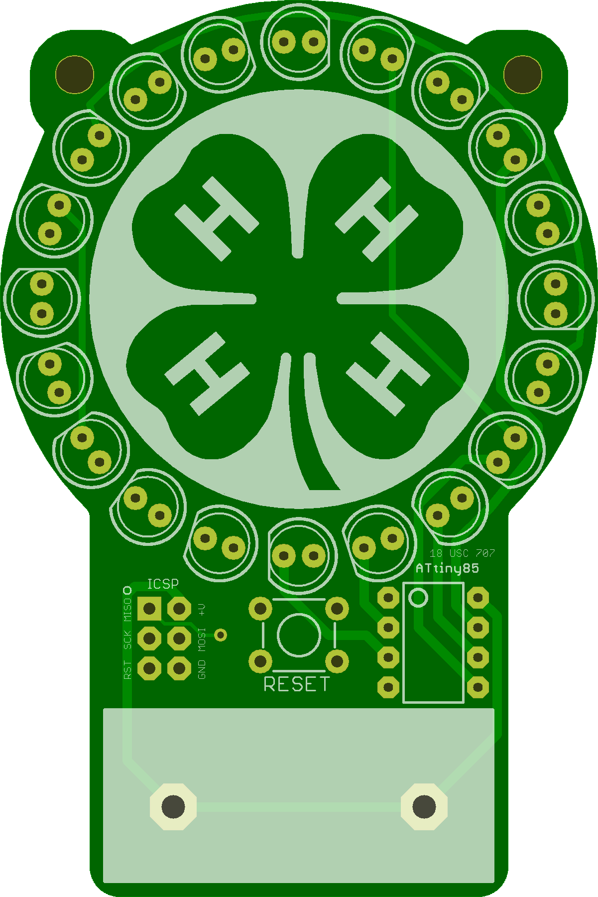
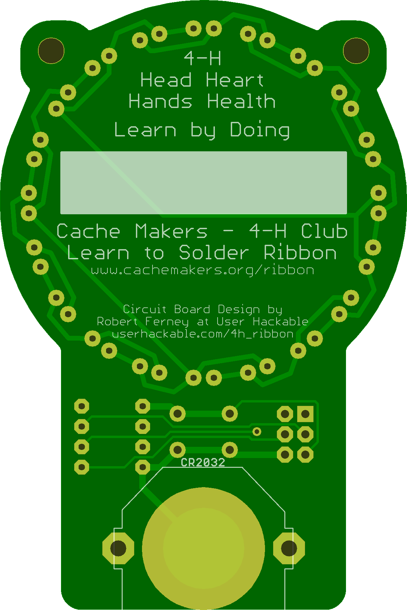

The [Cache Makers 4-H Club](http://cachemakers.org) LED Ribbon is a fun way to introduce soldering.
  		  
It does require soldering 20 leds, an 8 pin ATtiny85 microcontroller, a button, and a battery clip. 
## 4-HCloverMedallion 

### Board dimensions

* (200000, 300000) original units
* (2.0000, 3.0000) inches
* (50.8000, 76.2000) mm

| Front | Back |
| --- | --- |
|  |  |

